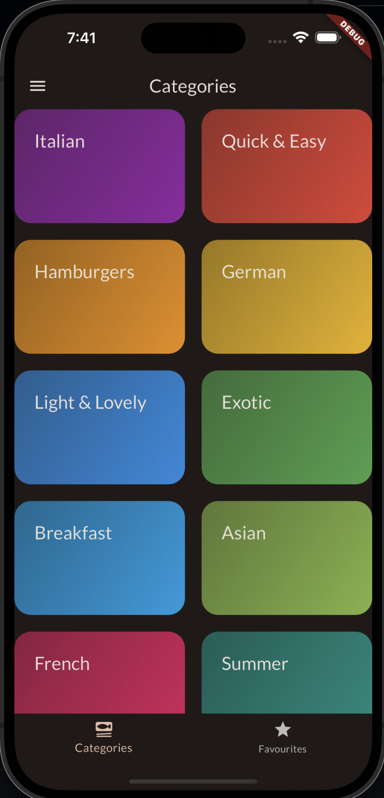
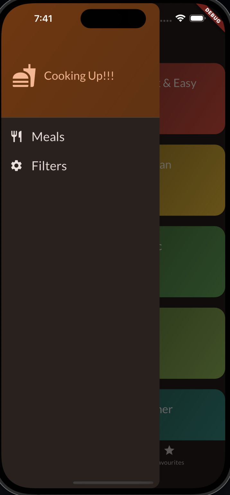
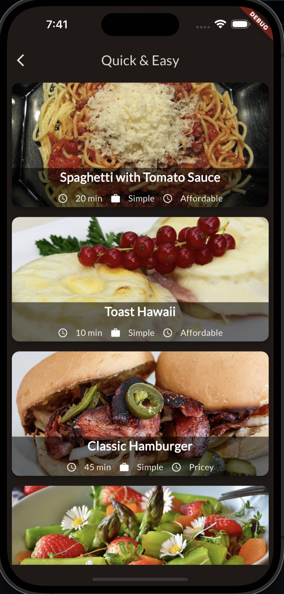
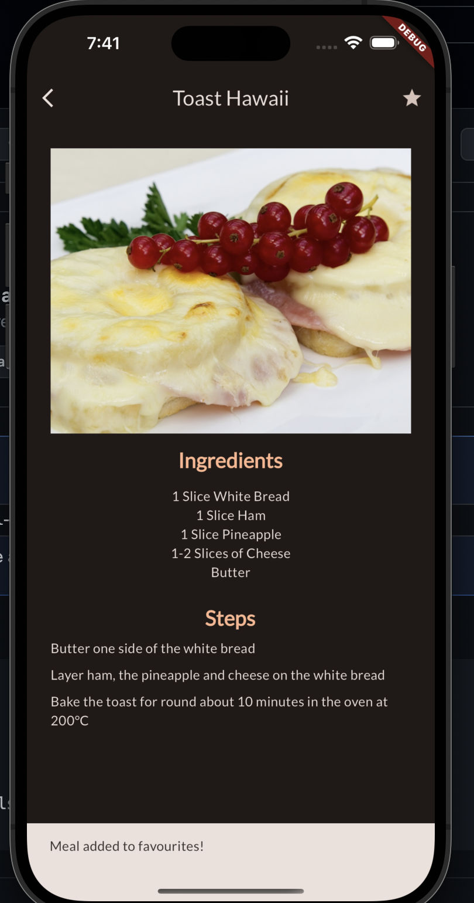

# Meals App

A Flutter app which allows user to browse various categories of meals, the ingredients and steps to prepare them, mark them as favourite, apply filters etc. Used to learn multi scren naviagtion using tabbars, routes, drawers, and state mangement using riverpod

